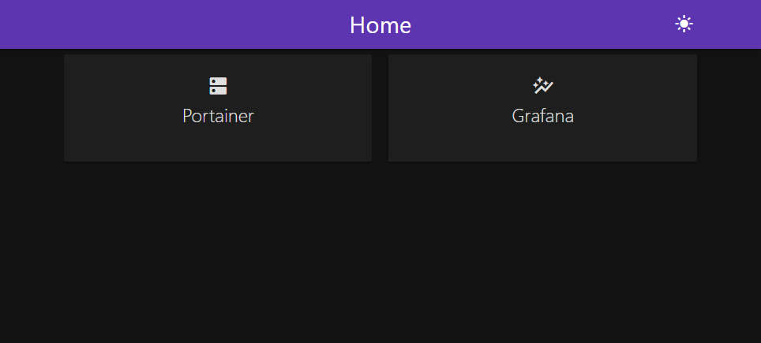

# homelab-portal

A super simple self-hosted portal for your homelab apps and bookmarks.

<!-- TODO: add screenshot -->



## ✨ Features

- Clean Material Design UI (powered by [MaterializeCSS](https://materializecss.com/))
- Light & Dark mode
- Clickable cards for your favorite apps
- No backend — just static files + config.json
- Runs anywhere with Docker

## 🚀 Quick Start

### 1. Clone and prepare config

```bash
git clone https://github.com/kmasouri/homelab-portal.git
cd homelab-portal
cp config.example.json config.json
```

Edit config.json with your own apps and bookmarks.

### 2. Run with Docker

```bash
docker run -d \
  -p 8080:80 \
  -v <path-to-your-config>:/usr/share/nginx/html/config.json:ro \
  ghcr.io/kmasouri/homelab-portal:latest
```

### 3. Visit in your browser

<http://localhost:8080>

## 🐋 Docker Compose / Swarm

Example `docker-compose.yaml`:

```yaml
services:
  homelab-portal:
    image: ghcr.io/kmasouri/homelab-portal:latest
    ports:
      - '8080:80'
    volumes:
      - <path-to-your-config>:/usr/share/nginx/html/config.json:ro
    deploy:
      replicas: 1
      restart_policy:
        condition: on-failure
```

Deploy with:

```bash
docker stack deploy -c docker-compose.yml homelab-portal
```

## ⚙️ Configuration

`config.json` controls how the portal looks and which links it shows.  
This file is **not baked into the Docker image** — you mount it at runtime so it’s fully customizable.

A sample file is provided as `config.example.json`.

### Options

| Key        | Type   | Description                                                                                    | Example                  |
| ---------- | ------ | ---------------------------------------------------------------------------------------------- | ------------------------ |
| `title`    | string | Title shown in the navbar                                                                      | `"Home"`                 |
| `theme`    | string | Theme mode, currently supports `"light"` or `"dark"`                                           | `"dark"`                 |
| `navColor` | string | Navbar color, accepts any [Materialize CSS color class](https://materializecss.com/color.html) | `"deep-purple darken-1"` |
| `links`    | array  | List of objects representing the cards shown on the portal                                     | _(see below)_            |

### Links

Each link object inside `links` must include:

| Key    | Type   | Description                                                     | Example                  |
| ------ | ------ | --------------------------------------------------------------- | ------------------------ |
| `name` | string | Display name                                                    | `"Grafana"`              |
| `url`  | string | Target URL                                                      | `"http://grafana.local"` |
| `icon` | string | [Material Icon](https://fonts.google.com/icons) name to display | `"dashboard"`            |

### Example `config.json`

```json
{
  "title": "Home",
  "theme": "dark",
  "navColor": "deep-purple darken-1",
  "links": [
    {
      "name": "Grafana",
      "url": "http://grafana.local",
      "icon": "dashboard"
    },
    {
      "name": "Portainer",
      "url": "http://portainer.local",
      "icon": "cloud"
    }
  ]
}
```

## 🛠️ Development

Run locally without Docker:

```bash
# Start local dev server
npx serve src
```

Or just open `src/index.html` in your browser.

## 📦 Image

Prebuilt image is available on GitHub Container Registry:

```bash
docker pull ghcr.io/kmasouri/homelab-portal:latest
```
